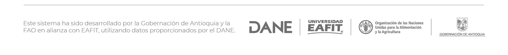

# **¿Cómo afecta cerrar una ruta de ingreso a Antioquia?**

El tablero muestra diferentes escenarios de vulnerabilidad del abastecimiento partiendo de supuestos de cierres viales. Este muestra los posibles efectos que tendría en las cantidades de alimento que ingresan a las centrales de acopio de Medellín según los diferentes escenarios de vulnerabilidad seleccionados. Esta información está disponible a nivel de año, mes y producto.

