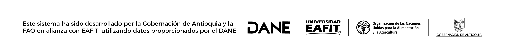

# **Relación entre volúmenes y precios de los alimentos**

Constituye una herramienta para conocer y comparar los precios y las cantidades de ciertos alimentos que conforman el abastecimiento en Antioquia. Facilita el acceso a información detallada sobre cada producto, así como la realización de comparaciones a lo largo de los meses del año tanto en términos de precios como de cantidades. Además, el análisis puede extenderse para abarcar cada año.

