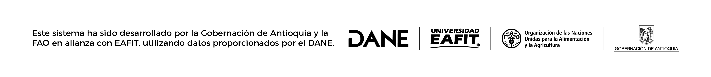

# **Comparación de precios**

El tablero facilita la observación y comparación de los precios de los alimentos según el municipio. Por ejemplo, es factible identificar en qué ciudades capitales resulta más costoso adquirir un determinado tipo de alimento. El tablero proporciona información general y el promedio de precios de cada uno de los alimentos, así como la posibilidad de conocer datos específicos por mes o año.

El mapa visualiza el departamento de cada una de las ciudades disponibles.

