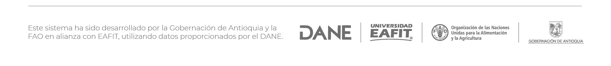

# Repositorio de Tableros SABA

Este repositorio contiene los códigos fuente de los tableros dinámicos realizados para el proyecto del Sistema de Monitoreo de Abastecimiento Agroalimentario de Antioquia (SIMONAA), desarrollado en colaboración entre la Universidad EAFIT, la Organización de las Naciones Unidas para la Alimentación y la Agricultura (FAO) y la Gobernación de Antioquia.

Los tableros proporcionan visualizaciones detalladas de diversas métricas generadas a partir de los datos del Sistema de Información de Precios y Abastecimiento del Sector Agropecuario (SIPSA), con un enfoque especial en los datos relacionados con Medellín. Cada tablero presenta una métrica específica, ofreciendo una comprensión profunda del abastecimiento agroalimentario en Antioquia.

# Contenido

**Pre1**: Comportamiento de los precios en el tiempo.

**Pre2**: Relación entre volúmenes y precios de los alimentos.

**Pre3**: Diferencia de precios entre ciudades.

**Pre4**: Comparación de precios.

**Abs1**: Importancia de los municipios que abastecen antioquia.

**Abs2**: ¿Qué tan importante es Antioquia para lo que envian otros departamento?

**Abs3**: Antioquia como productor de alimentos: importancia de los productos antioqueños en los departamentos destinos.

**Abs4**: Destino de la producción de alimentos de origen antioqueño.

**Abs5**: Composición detallada de los alimentos disponibles en Antioquia.

**Abs6**: Composición detallada de los alimentos de origen Antioqueño.

**Abs7**: Disponibilidad Neta de alimentos en Antioquia.

**Abs8**: Acumulado de los principales productos.

**Ind1**: Índice de diversidad de alimentos.

**Ind2**: índice de diversidad de origen de los alimentos.

**Ind3**: índice de diversidad de destino de los alimentos.

**Ind4**: Índice de vulnerabilidad del abastecimiento de alimentos de Antioquia.

**Maps1**: ¿Qué rutas toman los alimentos que llegan a Antioquia?

**Maps2**: ¿Cómo afecta cerrar una ruta de ingreso a Antioquia?

