# Repositorio de Tableros SABA

Este repositorio contiene los códigos fuentes de los tableros dinámicos realizados para el proyectos del Sistema de Abastecimiento Agroaliemntario de Antioquia, realizado entre la Universidad EAFIT, la Organización de la Naciones Unidad para la Alimentación y la Agricultura (FAO) y la Gobernación de Antioquia.

Los tableros consisten en las visualizaciones de las diferentes medidas creadas a partir de los datos del Sistema de Información de Precios y Abastecimiento del Sector Agropecuario (SIPSA), especialmente en las de Medellín. Cada tablero cuenta una medida diferente con una historia propia, todas con el fin de entender el abastecimiento agroalimentario de Antioquia.

# Contenido

Cada carpeta constituye un tablero. En total se construyeros 14 tableros:

**Tablero1_c**: Permite conocer el comportamiento histórico de los precios generales de los alimentos del abastecimiento de Antioquia. Permite seleccionar el tipo de producto del cual se quiere conocer el precio y además el año para el cual se quiere generar la información.

Está conformado por tres paneles que permiten, no solo conocer el precio de los alimentos si no también su variación a lo largo del tiempo. Específicamente, el panel A muestra el precio mensual promedio de los alimentos, el panel B muestra la variación mensual de los alimentos en el tiempo (t) con respecto al tiempo anterior (t-1) y el panel C muestra la variación del precio de los alimentos entre el mes (t) y el mes (t-11); ejemplo, la variación entre enero del 2019 y enero del 2018.

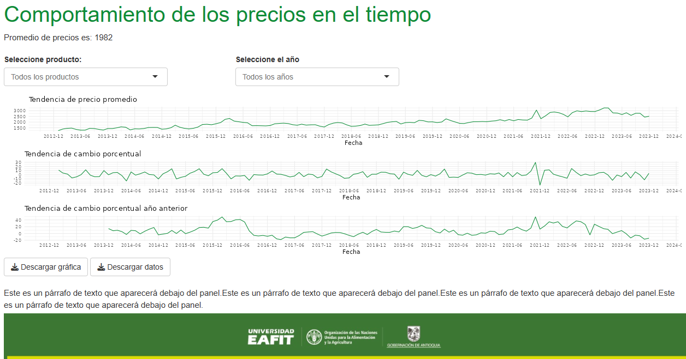 **Tablero1_d**: Constituye una herramienta para conocer y comparar tanto los precios, las cantidades y las distancias recorridad de ciertos alimentos que conforman el abastecimiento en Antioquia. Facilita el acceso a información detallada sobre cada producto, así como la realización de comparaciones a lo largo de los meses del año tanto en términos de precios como de cantidades. Además, el análisis puede extenderse para abarcar cada año.

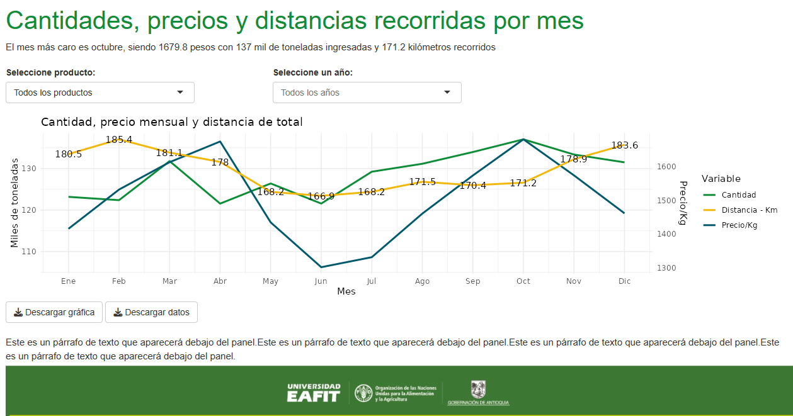 **Tablero1_e**: El tablero facilita la observación y comparación de los precios de los alimentos según el municipio. Por ejemplo, es factible identificar en qué ciudades capitales resulta más costoso adquirir un determinado tipo de alimento. El tablero proporciona información general y el promedio de precios de cada uno de los alimentos, así como la posibilidad de conocer datos específicos por mes o año.

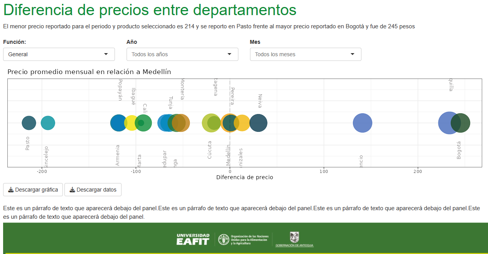 **Tablero1_i**: Mantiene la misma información del *tablero i* pero se visualiza en un mapa según el departamento de cada una de las ciudades disponibles.

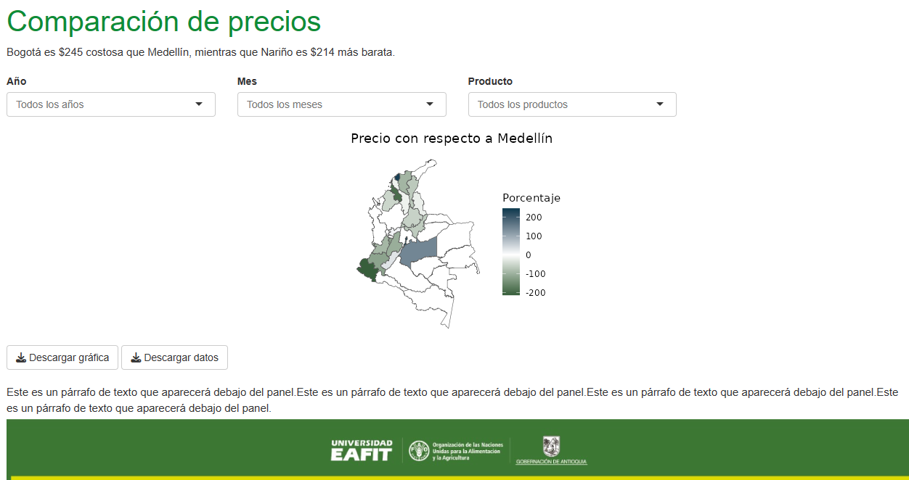 **Tablero2**: El tablero permite comprender la importancia que tiene cada municipio del país en el abastecimiento de Medellín. El tablero proporciona información detallada sobre todos los productos, permitiendo especificar el municipio del cual se desea obtener el alimento y/o el alimento del cual se quiere obtener información, así como el periodo de tiempo para el cual se desea generar la información.

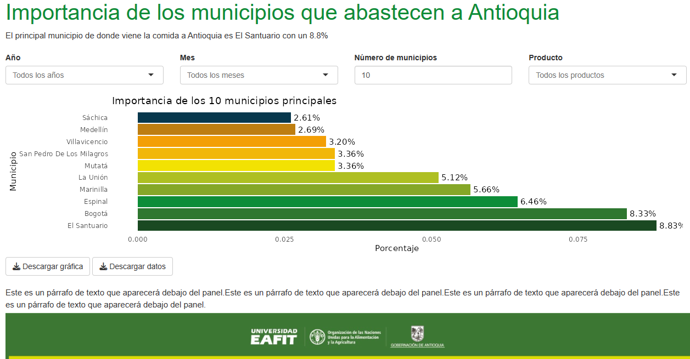 **Tablero3_c**: El propósito del tablero es evidenciar la importancia que Antioquia tiene como destino en los envíos de productos alimentarios de otros departamentos. Por ejemplo, en el mapa se puede observar que algunos departamentos envían hasta el 60% de su abastecimiento a Antioquia.

Además, esta herramienta proporciona acceso a información tanto general (para todos los años y todos los productos) como específica, permitiendo seleccionar un año y/o producto determinado.

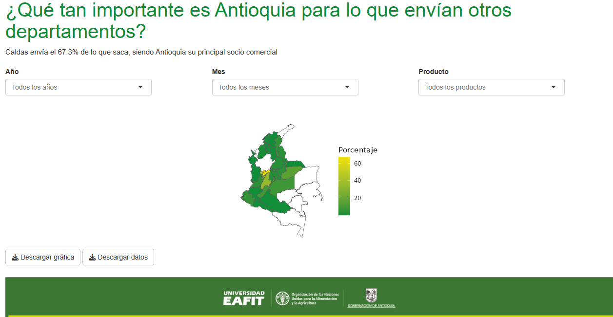 **Tablero3_f**: El propósito del tablero es evidenciar la importancia de la producción en Antioquia para el abastecimiento de otros departamentos. En otras palabras, muestra cuánto dependen los demás departamentos de los alimentos que provienen de municipios antioqueños. Por ejemplo, una lectura típica de este tablero sería: *"Del total de alimentos que recibe el Meta, ¿qué porcentaje proviene de Antioquia?"*.

Este tablero permite generar tanto información general (sobre todos los productos y todo el tiempo disponible) como información más específica, como seleccionar un año y/o producto.

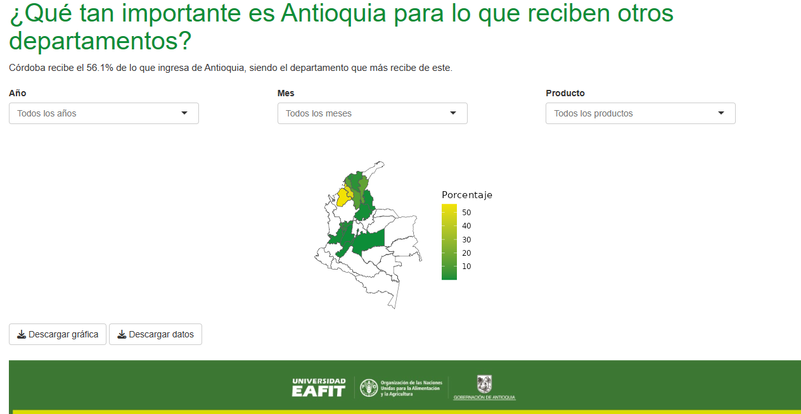 **Tablero5**: A través del tablero 7, se puede acceder a información sobre el abastecimiento neto de las centrales de acopio de Medellín. Este cálculo tiene como objetivo proporcionar un indicador aproximado del consumo en Medellín. Para obtener este valor, se resta la cantidad de kilogramos de alimentos que salen de Antioquia en el periodo (t) de la cantidad de alimentos que ingresan a Medellín en el mismo periodo (t).

Este tablero ofrece información histórica tanto anual como mensual, tanto general como por producto. Además, permite el análisis de varios productos seleccionados simultáneamente.

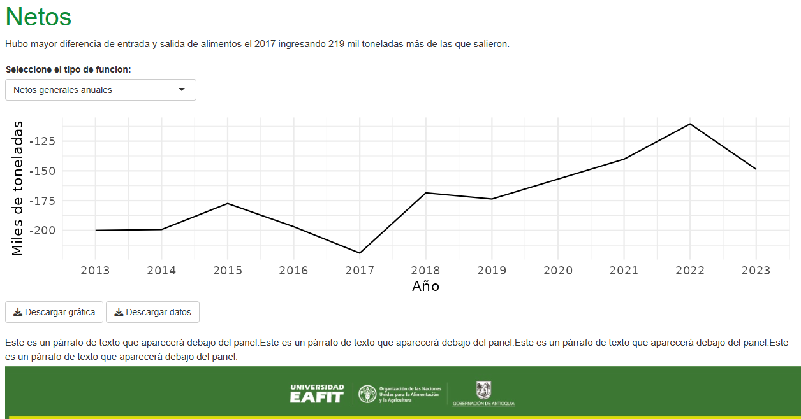 **Tablero6**: El tablero presenta los resultados del índice de Herfindahl-Hirschman (HH), diseñado para evaluar la diversidad de alimentos disponibles en Antioquia. El Panel A muestra el comportamiento del índice en términos mensuales o anuales. Por otro lado, el Panel B identifica los productos que más contribuyen al índice, es decir, los alimentos más "disponibles" en los centros de acopio de Medellín en un año y/o mes especifico.

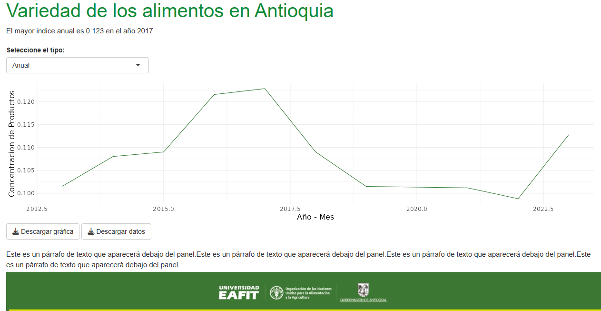

**Tablero7**: El tablero presenta los resultados del Índice Herfindahl-Hirschman, el cual calcula el nivel de concentración de los municipios que abastecen a Medellín. En otras palabras, este índice nos permite comprender qué tan concentrados están los municipios que suministran productos a las centrales de abastecimiento de Medellín. Un índice cercano a 1 indica que un solo municipio es responsable del abastecimiento, mientras que un índice cercano a cero indica que la provisión de Medellín depende de varios municipios.

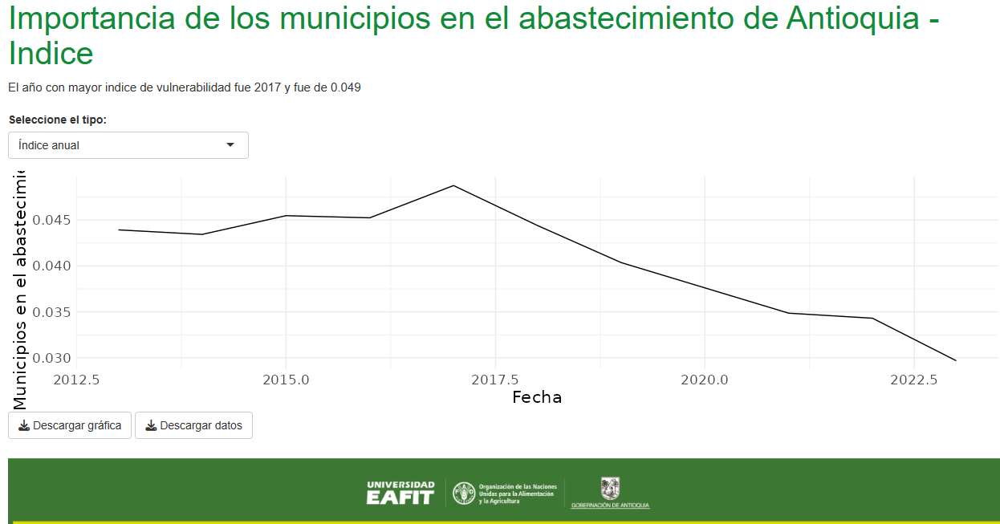 **Tablero9**: El Tablero muestra los resultados del Índice de Vulnerabilidad, el cual se construye considerando el número de municipios que abastecen un determinado alimento y la distancia que dicho alimento debe recorrer para llegar a Medellín. El Panel presenta el índice mensual o anual, tanto en términos generales como por producto. El objetivo es facilitar la comparación para determinar si un producto específico tiene una mayor probabilidad de desabastecimiento o si un mes dado es más vulnerable que el siguiente.

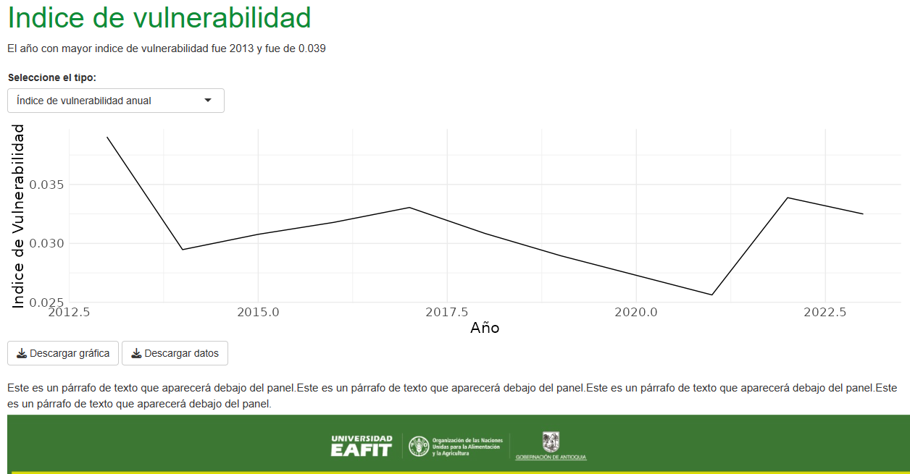 **Tablero10**: En el tablero se muestran los principales destinos de los alimentos que se tienen como origen (salen de) municipios de Antioquia. Por ejemplo, en la visualización propuesta podemos observar que teniendo en cuenta toda la información (todos los años y meses disponibles), la mayor parte del arroz, exactamente el 40.9% del arroz que sale de Antioquia se queda en Medellín.

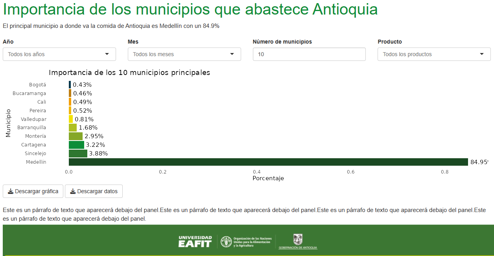 **Tablero11_c**: El tablero presenta los principales productos que entran a Medellín, esto con el fin de ver cuales productos son más propensos a ser ingresados. Esto lo podemos observar por año, mes o departamento de procedencia.

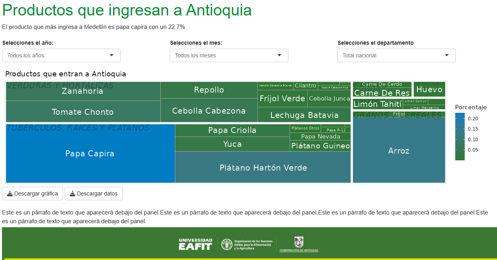 **Tablero11_e**: El tablero presenta los principales productos que salen de Antioquia, esto con el fin de ver cuales productos que tienen como origen el departamento. Esto lo podemos observar por año, mes o la ciudad de destino.

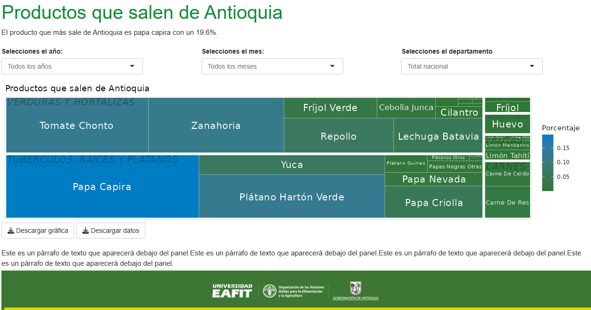
